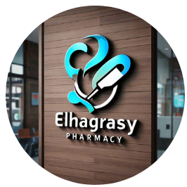

# 🏥 صيدلية الهجرسي – Omnya Mustafa

  

  
  
  
  
  

  <a href="#-مميزات-المشروع">المميزات</a> •
  <a href="#-التقنيات-المستخدمة">التقنيات</a> •
  <a href="#-هيكل-المشروع">الهيكل</a> •
  <a href="#-دليل-الاستخدام">الاستخدام</a> •
  <a href="#-التخصيص">التخصيص</a> •
  <a href="#-المطور">المطور</a>

---

## 📖 نبذة عن المشروع

**صيدلية الهجرسي** هي صفحة ويب تفاعلية عربية تمثل واجهة رقمية متكاملة للصيدلية، تهدف إلى تسهيل التواصل مع العملاء وتقديم خدمات صيدلانية متنوعة عبر الإنترنت. تم تصميم الصفحة لتكون **جذابة** و **سهلة الاستخدام** و **غنية بالمعلومات**، مع تركيز خاص على تجربة المستخدم السلسة على جميع الأجهزة.

> 💡 **الرؤية**: تقديم تجربة رقمية تعكس روح الصيدلية في تقديم الرعاية الصحية، مع توفير أدوات سريعة للتواصل والاستعلام عن الأدوية والخدمات.

---

## ✨ مميزات المشروع

| الميزة | الوصف |
|--------|-------|
| 🎬 **فيديو خلفية** | فيديو متحرك يضفي جواً حيوياً وجذاباً على الصفحة. |
| 🖼️ **شعار الصيدلية** | عرض شعار الصيدلية بشكل دائري أنيق. |
| 📱 **أيقونات تفاعلية** | أربع أيقونات رئيسية (الطوارئ، البحث، المعلومات، الخدمات) تنبثق منها قوائم منسدلة. |
| 🚚 **خدمات الطوارئ والتوصيل** | أرقام اتصال مباشر للطوارئ، والتوصيل للمنزل، والاستشارات الصيدلانية عبر الواتساب. |
| 🔍 **البحث عن دواء** | رابط للتحقق من توافر الأدوية، والاستعلام عن الأسعار. |
| 📋 **معلومات عن الصيدلية** | محتوى تفاعلي عن سنة التأسيس، الصيدلي المسؤول، الشهادات، سياسة الجودة، والشركاء. |
| ❓ **أسئلة شائعة (FAQ)** | قائمة موسعة من الأسئلة الشائعة مع إجاباتها (قابلة للطي). |
| 💡 **نصائح صحية** | نصائح صحية يومية مع إمكانية عرضها وإخفائها. |
| 🌐 **روابط التواصل الاجتماعي** | روابط مباشرة لفيسبوك، واتساب، البريد الإلكتروني، ومواقع الفروع. |
| 👨‍💻 **قسم المطور** | أزرار للانتقال إلى مشاريع أخرى ومتابعة المطور. |
| ⚡ **تفاعل سلس** | تأثيرات hover، إظهار/إخفاء المحتوى، وإغلاق القوائم تلقائياً عند النقر خارجها. |
| 📱 **تصميم متجاوب** | يعمل بشكل مثالي على الهواتف الذكية والأجهزة اللوحية والحواسيب. |

---

## 🛠️ التقنيات المستخدمة

- **HTML5** – هيكل الصفحة مع عناصر دلالية وميتا تاج محسنة.
- **CSS3** – تصميم مخصص بالكامل مع:
  - فيديو خلفية ثابت (`fixed`).
  - تنسيقات متجاوبة (`media queries` ضمن الكود المدمج).
  - تأثيرات `hover` و `transition`.
  - ألوان متناسقة (أسود، أبيض، بني داكن، ذهبي).
- **JavaScript (Vanilla ES6)** – منطق التفاعل الكامل:
  - إظهار/إخفاء القوائم المنسدلة.
  - إظهار/إخفاء المحتوى المخفي (نصوص، أسئلة، نصائح).
  - فتح روابط الواتساب بأرقام ورسائل مخصصة.
  - وظيفة الاتصال الهاتفي (مع تأكيد المستخدم).
  - إغلاق تلقائي للقوائم عند النقر خارجها.
- **Google Fonts** – (اختياري) يمكن إضافة خطوط عربية لتحسين المظهر.
- **Font Awesome** – (اختياري) يمكن استخدامه بدلاً من الأيقونات النصية.

> **ملاحظة**: المشروع لا يعتمد على أي مكتبات خارجية، كل الكود مكتوب يدوياً وبشكل نقي.

---

## 📂 هيكل المشروع
